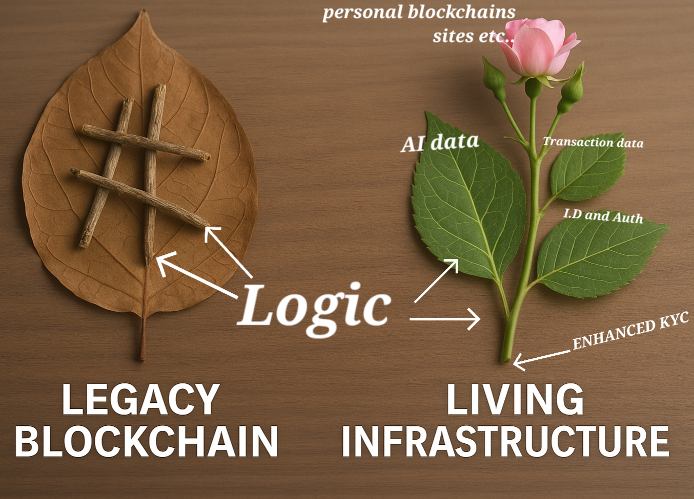

  

  

  

  
  
  

I'm An0myl0u5, a self-taught researcher and developer. I work on governance, research, identity, healthcare, travel and GitHub code and contributor intelligence, with a focus on making complex systems more useful and accountable to the people who rely on them.

I established **An0myl0u5 Research and Development** as an enterprise. [An0myl0u5 Research](https://github.com/An0myl0u5-Research) is the research organization connected to this work. This page is a personal view of what I study and build.

<em>“Don't vibe your code, Code your vibe”</em> — An0myl0u5

  
  
  
  
  
  

---

## 🛠 Tech Stack

<b>Languages</b>

  

<b>Frameworks & Runtime</b>

  

<b>Infrastructure & Databases</b>

  

<b>Blockchain & Cryptography</b>

  
  
  
  
  

---

## 🔭 What I'm Building

<table>
  <tr>
    <th align="left">Governance and identity</th>
  </tr>
  <tr>
    <td width="100%">
      <h3>🌐 An0myl0u5 Network / Ωm3gA</h3>
      
A large-scale design for decentralised governance and identity, with geographic namespaces supporting participation and local decision-making.

    </td>
  </tr>
  <tr>
    <th align="left">Research and intelligence</th>
  </tr>
  <tr>
    <td width="100%">
      <h3>🔬 An0m5-ARC</h3>
      
A cross-domain research platform that organises source-cited documents, evidence and relationships across public-interest subjects.

    </td>
  </tr>
  <tr>
    <td width="100%">
      <h3>🧩 LexiVibe</h3>
      
A modular research environment for examining language, symbols and evidence through analysis and graph-based views.

    </td>
  </tr>
  <tr>
    <td width="100%">
      <h3>🧭 An0matr1X</h3>
      
A GitHub code and contributor intelligence platform for examining contribution history, follower and following relationships, forks, and code complexity in relation to practical utility. Its anti-gaming work examines contributor manipulation and repository squatting, alongside wider supply-chain risk. README cards and an investigation workspace offer different ways to explore the evidence.

    </td>
  </tr>
  <tr>
    <th align="left">Access and travel</th>
  </tr>
  <tr>
    <td width="100%">
      <h3>🦷 NHS Dental Booking System</h3>
      
A dental access and booking system whose waiting-list and geographic matching logic considers clinical urgency, accessibility needs and patients’ personal constraints, including travel limits.

    </td>
  </tr>
  <tr>
    <td width="100%">
      <h3>😃 HolidaySmile</h3>
      
A calendar-led <strong>custom</strong> travel package builder combining itinerary planning with recommendation and pricing algorithms and availability checks. It foregrounds local culture, independent experiences and distinctive destinations.

      
<a href="mailto:contact@holidaysmile.org">contact@holidaysmile.org</a>

    </td>
  </tr>
</table>

  

---

## 📊 GitHub Stats

  
  

  

  

  

---

## 🐍 Contribution Snake

  

---

## 🔗 Connect

  
  
  
  

### 🛡️ Defensive Threat Intel

I also write [OSINT and OpSec research notes](https://github.com/An0myl0u5-Lite/OSINT-OpSec) on supply-chain bait and practical detection for students and analysts.

## 💡 More About Me

- I'm autistic. I pay close attention to how complex systems fit together and how people experience them.
- I built the early An0myl0u5 prototype on a Samsung S20 phone, before I had a laptop for the work.
- I taught myself across blockchain, cryptography, distributed systems, economics and political science, among other fields.
- I care about governance as a public good, with privacy, verifiable participation and accountability built in.

  

